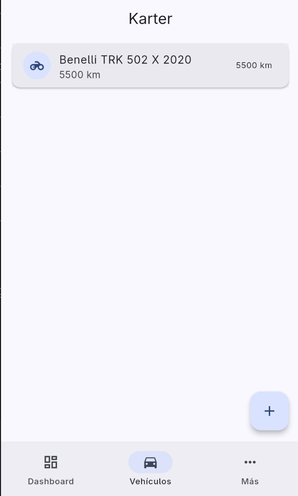
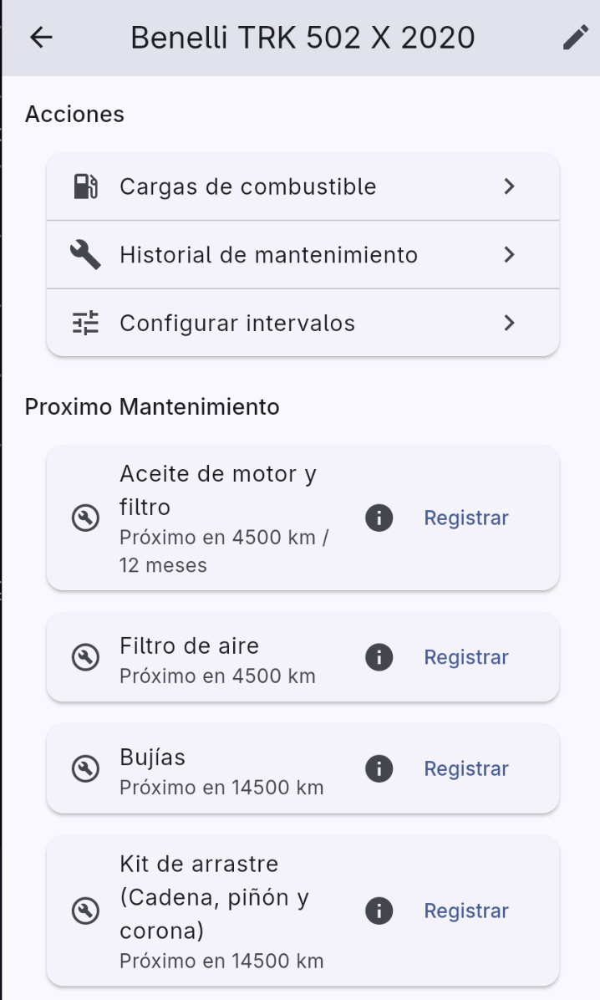
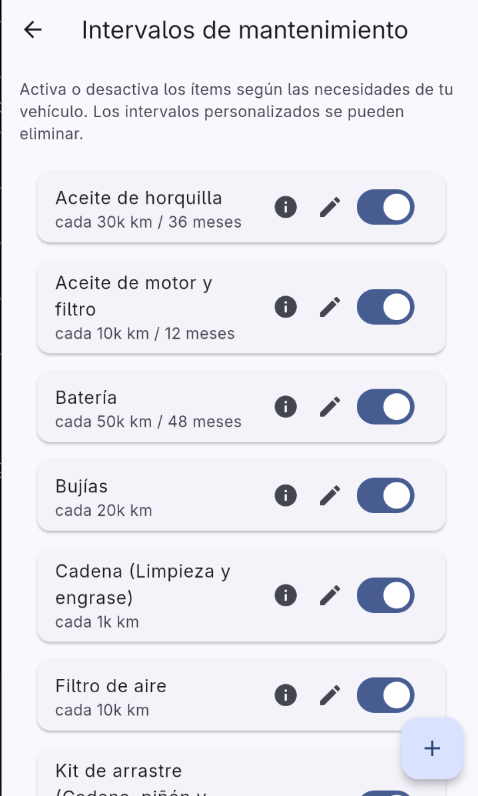

<picture>
  <source media="(prefers-color-scheme: dark)" srcset="docs/static/img/karter-logo-stacked.svg">
  
</picture>

**Open source vehicle maintenance tracker**

[](https://github.com/abrahdev/karter/actions/workflows/ci.yml)
[](https://github.com/abrahdev/karter/actions/workflows/release.yml)
[](LICENSE)

[](https://karter.abrah.dev/)
[](https://f-droid.org)

---

## Features

- **Multi-vehicle management** — add, edit, delete vehicles with VIN, plate, and type
- **Fuel tracking** — log fill-ups with automatic economy calculations (MPG, L/100km, km/L)
- **Maintenance log** — track repairs, part replacements, and service history
- **Service intervals** — set custom reminders based on distance or time
- **Spare parts** — catalog and track replacement parts with costs
- **JSON export** — export all data for external analysis
- **Odometer tracking** — log readings in km or mi
- **OBD-II integration** — ELM327 support (coming soon)
- **Material Design 3** — with dark mode support
- **100% offline** — no account, no telemetry, no tracking

---

## Screenshots

<p align="center">
  
  
  
</p>

---

## Installation

### GitHub Releases (APK)

Download the latest APK from [GitHub Releases](https://github.com/abrahdev/karter/releases).

### Obtanium

Add `https://github.com/abrahdev/karter` as an app source in [Obtanium](https://obtanium.org) to auto-update from GitHub Releases.

### F-Droid

Coming soon. [Track progress](https://github.com/abrahdev/karter/issues).

### Build from source

```bash
git clone https://github.com/abrahdev/karter.git
cd karter/mobile
flutter pub get
flutter build apk --release
```

The APK will be at `mobile/build/app/outputs/flutter-apk/app-release.apk`.

---

## Documentation

Full documentation is available at [karter.abrah.dev](https://karter.abrah.dev/).

- [Architecture](https://karter.abrah.dev/developer/mobile/app-architecture)
- [Contributing](https://karter.abrah.dev/contributing/contributing)
- [Roadmap](https://karter.abrah.dev/roadmap)

---

## Contributing

See the [Contributing Guide](https://karter.abrah.dev/contributing/contributing).

This project follows a [Code of Conduct](https://github.com/abrahdev/karter/blob/main/docs/docs/contributing/contributing.md).

---

## License

[GNU Affero General Public License v3](LICENSE)

20% of donations and future revenue goes to organizations dedicated to traffic accidents
