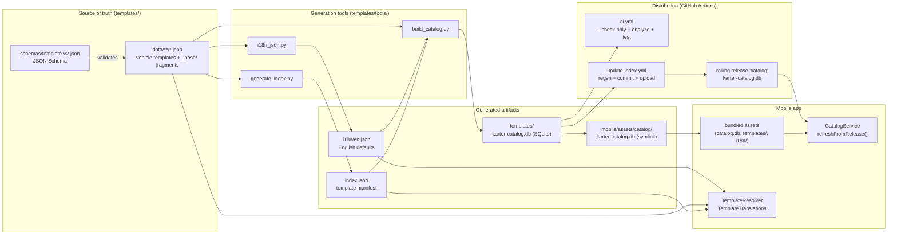
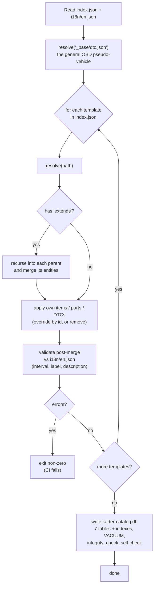
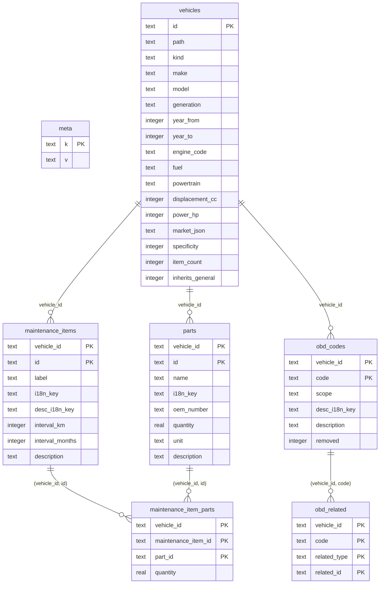
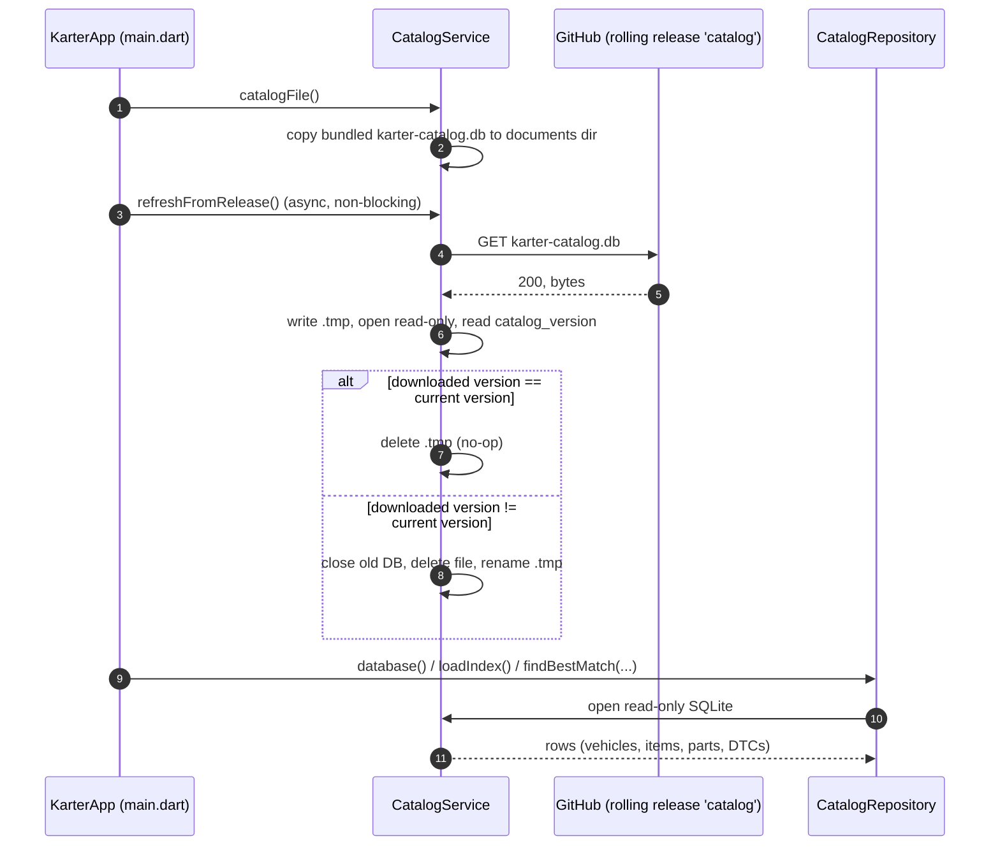

# Data & Template Pipeline

This page explains how maintenance data flows from the source JSON templates into the mobile app: where the data comes from, how the schema JSONs become a SQLite database, and how the indices and update mechanisms work.

## Where the data comes from

The source of truth is the `templates/` directory at the repository root. It is a self-contained, human-editable package that can also be forked by communities to create their own template repos.

| Path | Purpose |
| :--- | :--- |
| `templates/data/` | Vehicle templates, grouped by manufacturer, plus `_base/` fragments |
| `templates/data/_base/` | Reusable base fragments: `car-common`, `car-combustion`, `car-diesel`, `car-electric`, `motorcycle-common`, `motorcycle-2t`, `motorcycle-4t`, `motorcycle-ev`, and `dtc.json` (the general OBD-II code set) |
| `templates/i18n/` | Community translations (`en.json` generated, `es.json` / `et.json` curated) |
| `templates/schemas/template-v2.json` | JSON Schema that validates the template format |
| `templates/index.json` | Generated manifest of every indexable vehicle template |
| `templates/tools/` | Generation scripts (`build_catalog.py`, `generate_index.py`, `i18n_json.py`, `import_dtc.py`) |
| `templates/NOTICE.md` | MIT attribution for the `dtc-database` (Wal33D) that feeds the general OBD codes |

### Template format (v2)

Every template JSON describes one vehicle (or a shared base fragment) and references other fragments through an `extends` chain:

```json
{
  "id": "toyota-corolla",
  "meta": {
    "make": "Toyota",
    "model": "Corolla",
    "generation": "E210",
    "years": [2019, 2024],
    "engine": { "code": "M20A-FKS", "fuel": "gasoline", "displacement_cc": 1987, "power_hp": 169 }
  },
  "extends": ["_base/car-common.json", "_base/car-combustion.json"],
  "maintenance_items": [
    {
      "id": "oil-change",
      "i18n_key": "oil-change",
      "interval_km": 15000,
      "interval_months": 12,
      "parts": [{ "part_id": "oil-filter", "quantity": 1 }]
    }
  ],
  "parts": [
    { "id": "oil-filter", "name": "Oil filter", "i18n_key": "oil-filter", "oem_number": "90915-YZZE3" }
  ],
  "obd_dtc_definitions": [
    {
      "code": "P1100",
      "scope": "toyota",
      "related_maintenance": ["oil-change"],
      "related_parts": ["oil-filter"]
    }
  ]
}
```

Entities can be **overridden** by re-declaring the same `id`/`code` in a more specific template, or **removed** with `"remove": true`. Maintenance items reference parts through `parts: [{ "part_id", "quantity" }]`, and DTCs reference suggested maintenance items/parts through `related_maintenance` / `related_parts`.

Localizable text is declared once per language key (`i18n_key`, `desc_i18n_key`). The English default text lives in the template itself and is extracted into `templates/i18n/en.json`; `es.json` and `et.json` provide the community translations.

## How JSON becomes a database

Three tools in `templates/tools/` turn the source tree into artifacts:

| Tool | Input | Output |
| :--- | :--- | :--- |
| `generate_index.py` | every `*.json` under `templates/data/` | `templates/index.json` |
| `i18n_json.py` | every template's `i18n_key` / `desc_i18n_key` defaults | `templates/i18n/en.json` |
| `build_catalog.py` | `index.json` + `data/**` + `i18n/en.json` | `templates/karter-catalog.db` (symlinked from `mobile/assets/catalog/`) |

`generate_index.py` walks `templates/data/` and emits one `index.json` entry per template that has a `maintenance_items` array (fragments without items are skipped). Entries are sorted `_base` first, then by make/model. The `generated_at` timestamp doubles as the `catalog_version` stored inside the database.

`i18n_json.py` scans `_base/` first so the canonical base text wins when several templates reuse the same key. It is idempotent, never deletes curated keys, and reports a warning when a key is reused with different text (`--check` makes it fail instead).



## build_catalog.py: resolution, validation, and writing

`build_catalog.py` is the heart of the pipeline. It mirrors the resolution logic in the app (`mobile/lib/data/services/template_resolver.dart`) so that what is built locally and what the app computes at runtime stay in sync. It supports a `--check-only` mode used by CI to validate without writing the database.



### The SQLite schema

The database is opened read-only by the app. Foreign keys are logical (SQLite constraints are not enforced); joins are done by `vehicle_id`.



| Table | Content |
| :--- | :--- |
| `meta` | Key/value metadata: `schema_version`, `catalog_version`, `built_at` |
| `vehicles` | One row per indexable template plus the `general` OBD pseudo-vehicle (`_base/dtc.json`) |
| `maintenance_items` | Flattened, merged maintenance items per vehicle |
| `parts` | Flattened, merged spare parts per vehicle |
| `maintenance_item_parts` | Join: parts referenced by each maintenance item |
| `obd_codes` | General OBD codes plus per-vehicle overrides and `removed = 1` diff rows |
| `obd_related` | DTC → suggested maintenance items / parts |

Indexes are created on `vehicles(make)`, `vehicles(make, model)`, `maintenance_items(vehicle_id)`, `parts(vehicle_id)`, `obd_codes(vehicle_id, code)`, and `obd_related(vehicle_id, code)`.

### The indices

- **`templates/index.json`** is the manifest the app uses to know which vehicles exist and where each template lives. In the catalog DB it becomes the `vehicles` table.
- **`CatalogRepository.findBestMatch(make, model, year)`** (`mobile/lib/data/services/catalog_repository.dart`) selects the best template with:

  ```
  WHERE make = ? AND model = ? AND (year_from IS NULL OR ? BETWEEN year_from AND year_to)
  ORDER BY CASE WHEN year_from IS NOT NULL THEN 0 ELSE 1 END, specificity DESC
  ```

  `specificity` (computed by `build_catalog.py`) scores how specific a template is: `generation` (+1), `engine` (+1), engine `code` (+1), engine `fuel` (+1), and `years` (+1). DTCs from `_base/dtc.json` are inherited per vehicle unless overridden or `removed`, matching the `inherits_general` flag.

## How the app fetches updates

The app bundles the catalog and templates as assets, and refreshes them over the network when a template source is enabled (the default).

| Mechanism | File | Behavior |
| :--- | :--- | :--- |
| Bundled catalog | `templates/karter-catalog.db` | Built by `build_catalog.py`, symlinked from `mobile/assets/catalog/karter-catalog.db` and copied to the documents directory on first run (`CatalogService.catalogFile`) |
| Live catalog | `CatalogService.refreshFromRelease()` | Downloads the latest DB from the rolling GitHub release `catalog`, compares `catalog_version`, and swaps the file only if different |
| Template JSONs | `TemplateResolver` | Fetches `index.json` and `data/**/*.json` from the configured repo URL (default `https://github.com/abrahdev/karter/templates`), falling back to bundled assets |
| Translations | `TemplateTranslations` | Fetches `i18n/{locale}.json` from the same URL at startup, falling back to bundled assets |

The template source URL is configurable in the More page (`TemplateSourceConfig`), which is what allows community forks to plug in their own template repo. The catalog refresh is fire-and-forget at startup and silently ignores network errors so the app always works offline.

Because the catalog DB is generated (and gitignored), a fresh checkout must run `python templates/tools/build_catalog.py` before building the app; the `build_catalog.py` step creates `templates/karter-catalog.db` and the `mobile/assets/catalog/` symlink. CI and release workflows already do this.



## CI / CD

| Workflow | Trigger | What it does |
| :--- | :--- | :--- |
| `ci.yml` | PRs and pushes to `main` | Runs `build_catalog.py --check-only` (validates every template merge) and `flutter analyze` + `flutter test` |
| `update-index.yml` | `templates/**` changes on `main` | Regenerates `index.json`, rebuilds `templates/karter-catalog.db`, commits `index.json` if changed, and uploads the DB to the rolling `catalog` release |
| `release.yml` | `VERSION` change | Builds the Android APK and Linux bundle and publishes a GitHub release |
| `deploy-docs.yml` | `docs/**` changes | Builds and deploys this documentation site |

End to end: a contributor edits a template JSON → CI validates it on the PR → on merge `update-index.yml` rebuilds the artifacts and publishes the DB → the next time the app starts it pulls the new catalog and picks up the new maintenance data.
