Karter follows a **clean-ish layered architecture** with three main layers: `domain/`, `data/`, and `presentation/`. State management is handled by **Riverpod**, and local persistence by **Drift** (SQLite).

---

## Overview

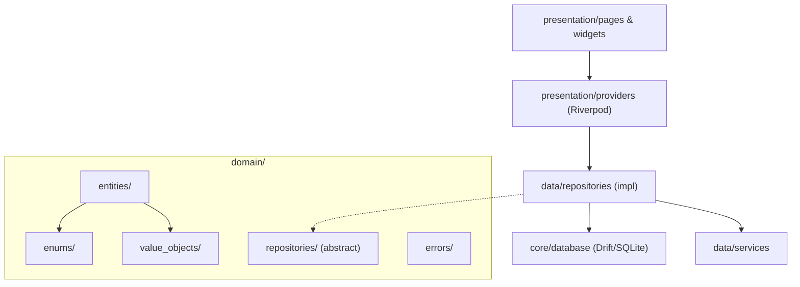

---

## Core Entities

### Vehicle

The root aggregate of the domain.

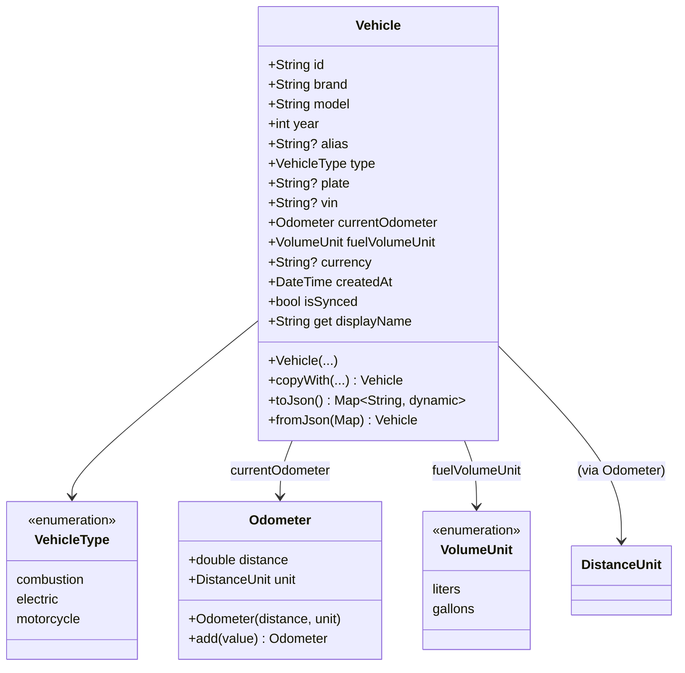

**Notes:**
- `plate` and `vin` are stored as plain `String?`, backed by value objects in `domain/value_objects/` for validation.
- `currency` is a 3-letter ISO code string (USD, ARS, EUR, etc.) used for fuel price and service cost display.
- `fuelVolumeUnit` determines whether fuel-ups display in liters or gallons.

---

### FuelLog

Records a refueling event to track expenses and calculate consumption.

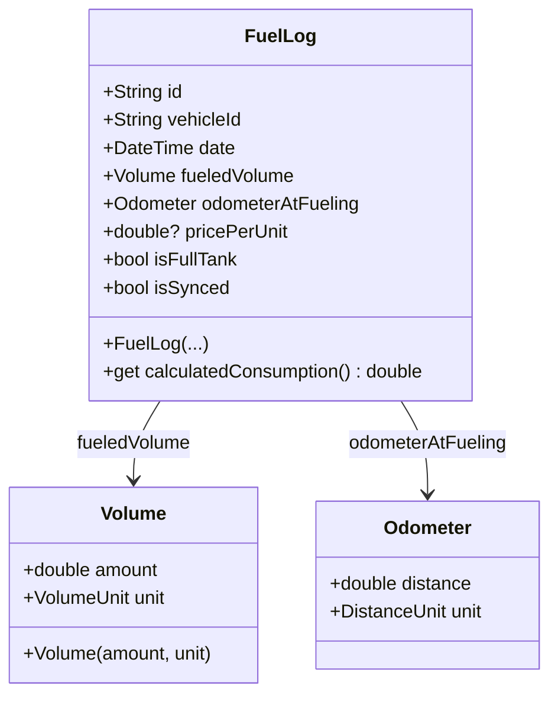

- `calculatedConsumption` returns L/100km or MPG depending on units.
- Volume unit is **inherited from vehicle settings**, not stored per entry.
- `pricePerUnit` is displayed with the vehicle's currency symbol.

---

### MaintenanceLog

Records services or repairs performed on the vehicle.

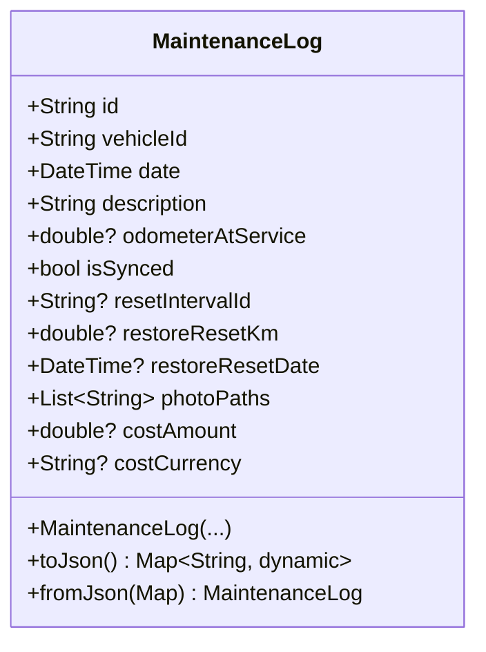

- `photoPaths` are stored as file paths to images in `{appDocDir}/maintenance_photos/{logId}/`.
- `costAmount`/`costCurrency` store historical cost values independent of vehicle's current currency setting.

---

### VehicleDocument

Attaches files (receipts, photos, PDFs) to a vehicle.

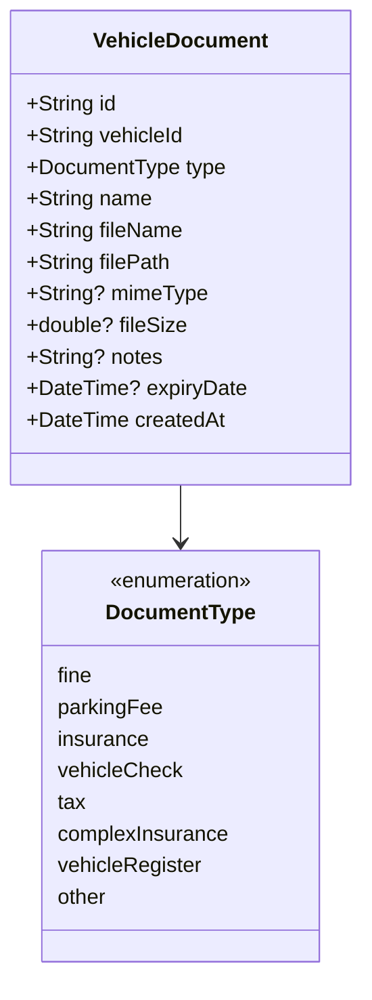

- Files are stored at `{appDocDir}/documents/{vehicleId}/{uuid}.{ext}`.
- Document types are displayed with localized labels and icons.

---

### MaintenanceInterval

Tracks periodic maintenance tasks with km/time thresholds.

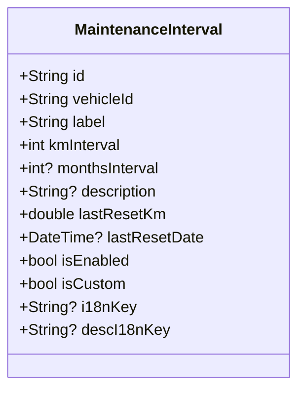

- `i18nKey`/`descI18nKey` map to JSON keys in `i18n/*.json` for built-in intervals (oil change, filters, etc.), resolved via `TemplateTranslations`.
- `isCustom` distinguishes user-created intervals from seeded defaults.
- `lastResetKm`/`lastResetDate` track the last service reset for "next in X km" calculations.

---

## Enums

| Enum | File | Values |
|------|------|--------|
| `VehicleType` | `domain/enums/vehicle_type.dart` | `combustion`, `electric`, `motorcycle` |
| `DistanceUnit` | `domain/enums/distance_unit.dart` | `kilometers`, `miles` |
| `VolumeUnit` | `domain/enums/volume_unit.dart` | `liters`, `gallons` |
| `DocumentType` | `domain/enums/document_type.dart` | `fine`, `parkingFee`, `insurance`, `vehicleCheck`, `tax`, `complexInsurance`, `vehicleRegister`, `other` |
| `CoreError` | `domain/enums/core_error.dart` | `emptyLicensePlate`, `invalidLicensePlateFormat`, `negativeOdometer`, `invalidVehicleYear`, `invalidVinFormat` |

---

## Value Objects

Immutable objects that enforce formatting and prevent primitive obsession.

### Odometer

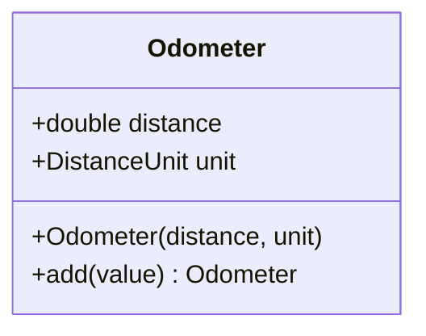

### Volume

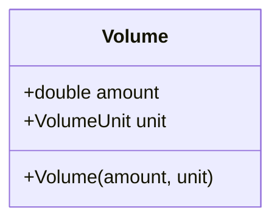

### Plate

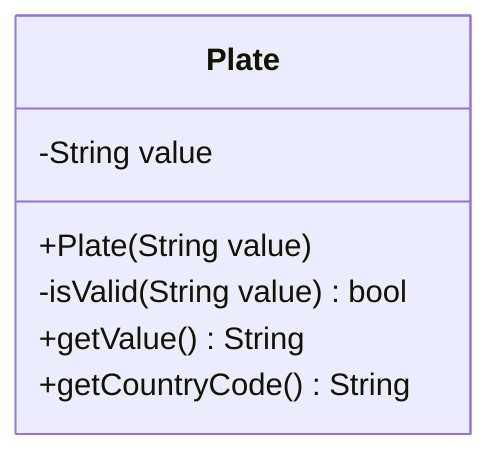

Validates license plate format by country code. Currently supports Argentina (ABC·123, AB·123·CD) and generic alphanumeric formats.

### VIN

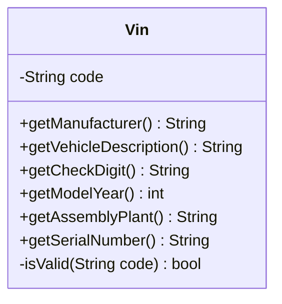

Validates 17-character VIN structure and extracts:

| Position | Section | Description |
|----------|---------|-------------|
| 1 - 3 | WMI | World Manufacturer Identifier |
| 4 - 8 | VDS | Vehicle Descriptor Section |
| 9 | VDS | Check Digit |
| 10 | VIS | Model Year |
| 11 | VIS | Plant Code |
| 12 - 17 | VIS | Serial Number |

---

## Error Handling

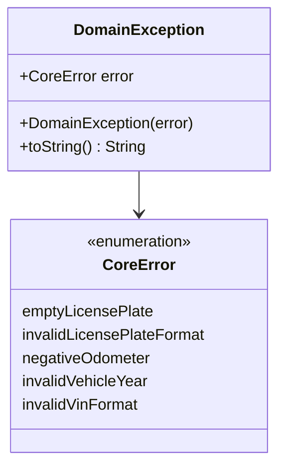

All business rule violations throw `DomainException` with a `CoreError` enum value. Presentation layer catches these to show localized error messages.

---

## Data Services

### Template Resolution (`data/services/template_resolver.dart`)

Loads vehicle maintenance templates from bundled JSON assets. Templates define default maintenance intervals for specific make/model/year combinations.

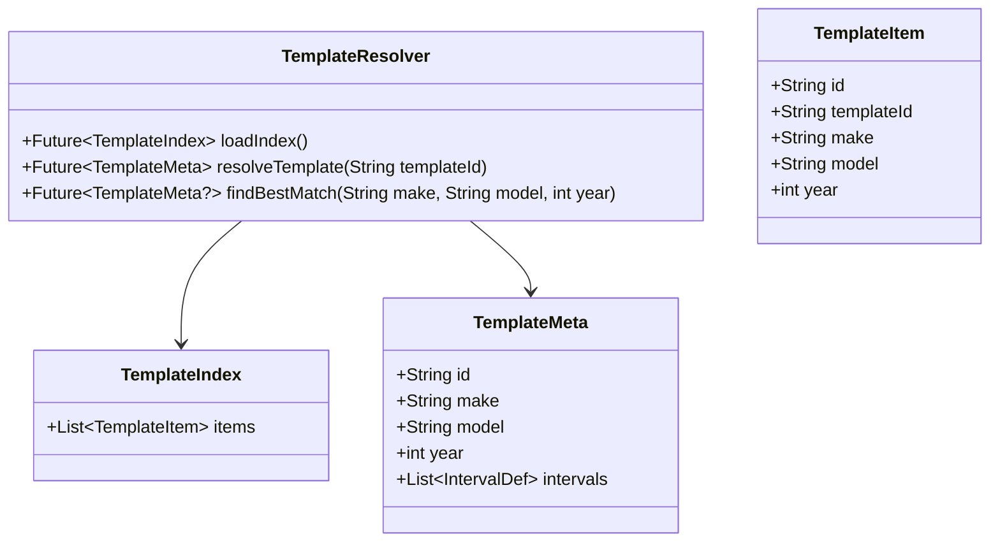

- Templates are JSON files in the bundled `templates/data/` directory.
- `findBestMatch()` searches by make + model + year and returns the best matching template.
- Used in the vehicle creation form ("Buscar plantilla" button).

### Template Translations (`data/services/template_translations.dart`)

Loads community/template translations (maintenance item names, descriptions, brand names) from flat JSON files in `templates/i18n/`. These are separate from the ARB-based UI translations in `lib/l10n/`. Supports remote fetch (same GitHub URL as templates) with local asset fallback.

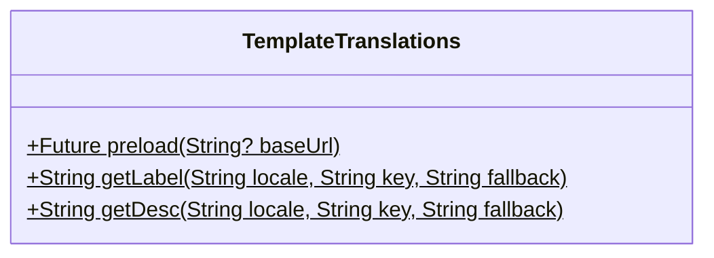

- Translations are preloaded at app startup in `main()`, respecting the template source config (online/offline).
- Remote mode: fetches from `{repoUrl}/i18n/{locale}.json`, falls back to bundled `templates/i18n/` on failure.
- `maintenance_localizer.dart` uses this service to resolve interval names/descriptions.
- JSON format is flat key-value (`{"seed_interval_oil_change": "Oil change"}`) for easy community contribution.
- Two files: `templates/i18n/en.json` (English) and `templates/i18n/es.json` (Spanish). Accessible in the app via a symlink at `mobile/i18n/` (listed as a separate asset in `pubspec.yaml` since Flutter doesn't recursively bundle symlinked subdirectories on Linux).

### PDF Export (`data/services/pdf_export_service.dart`)

Generates maintenance report PDFs using the `pdf` and `printing` packages.

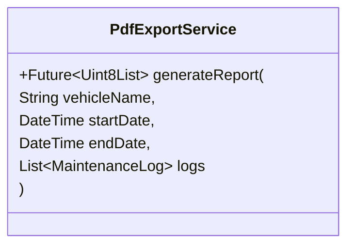

- Output: in-memory PDF bytes, shared via `Share.shareXFiles`.
- Uses Roboto font from `PdfGoogleFonts` (bundled with `printing` package) for Unicode support.
- Linux desktop fallback: `xdg-open` since `share_plus` is unimplemented.

### Data Export/Import (`data/services/export_service.dart`)

Exports all vehicle data (vehicles, fuel logs, maintenance logs) as a JSON file for backup or transfer.

---

## Persistence

### Drift Database (`core/database/app_database.dart`)

| Table | Schema Version Added | Notes |
|-------|---------------------|-------|
| `Vehicles` | v1 | Has `fuelVolumeUnit` (v9), `currency` (v10) |
| `FuelLogs` | v1 | |
| `MaintenanceLogs` | v1 | Has `photoPaths`, `costAmount`, `costCurrency` (v10) |
| `MaintenanceIntervals` | v1 | |
| `VehicleDocuments` | v7 | |

**Current schema version:** **10**

Migrations are handled incrementally in `MigrationStrategy` inside `app_database.dart`. Each schema change adds a `migrate.fromCallback` step.

---

## Providers (Riverpod)

All providers are defined in `presentation/providers/vehicle_providers.dart` and `locale_provider.dart`.

### Repository Providers (singletons)

| Provider | Type | Returns |
|----------|------|---------|
| `appDatabaseProvider` | `Provider<AppDatabase>` | Database instance |
| `vehicleRepositoryProvider` | `Provider<VehicleRepository>` | `VehicleRepositoryImpl` |
| `fuelLogRepositoryProvider` | `Provider<FuelLogRepository>` | `FuelLogRepositoryImpl` |
| `maintenanceLogRepositoryProvider` | `Provider<MaintenanceLogRepository>` | `MaintenanceLogRepositoryImpl` |
| `maintenanceIntervalRepositoryProvider` | `Provider<MaintenanceIntervalRepository>` | `MaintenanceIntervalRepositoryImpl` |
| `vehicleDocumentRepositoryProvider` | `Provider<VehicleDocumentRepository>` | `VehicleDocumentRepositoryImpl` |
| `exportServiceProvider` | `Provider<ExportService>` | `ExportService` |
| `templateResolverProvider` | `Provider<TemplateResolver>` | `TemplateResolver` |
| `pdfExportServiceProvider` | `Provider<PdfExportService>` | `PdfExportService` |

### Data Providers (async, family by vehicleId)

| Provider | Returns |
|----------|---------|
| `vehicleListProvider` | `List<Vehicle>` |
| `vehicleProvider(vehicleId)` | `Vehicle?` |
| `fuelLogsProvider(vehicleId)` | `List<FuelLog>` |
| `maintenanceLogsProvider(vehicleId)` | `List<MaintenanceLog>` |
| `maintenanceIntervalsProvider(vehicleId)` | `List<MaintenanceInterval>` |
| `vehicleDocumentsProvider(vehicleId)` | `List<VehicleDocument>` |

### Locale Provider

| Provider | Purpose |
|----------|---------|
| `localeProvider` | Read/write current locale (en/es), persisted in `SharedPreferences` |

---

## Data Flow Example

```
User taps "Add fuel log"
  → vehicle_detail_page calls showAddFuelLogModal(context, vehicleId)
  → Modal reads vehicle from ref (for odometer, volume unit, currency)
  → User fills form, taps "Save"
  → Modal calls fuelLogRepositoryProvider.save(FuelLog(...))
  → Repository impl converts to Drift companion, inserts row
  → Modal pops with result=true
  → Vehicle detail page invalidates fuelLogsProvider to refresh UI
```

- There is no use-case/orchestrator layer — providers call repositories directly.
- Modals return `bool` to signal success; the caller invalidates the relevant provider.
