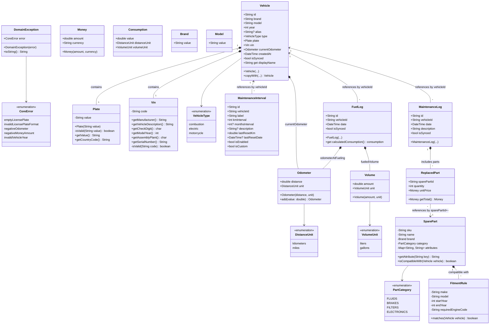

 ## Objects

### Imutable Value Objects
#### VIN (Vehicle Identification Number)
 ```mermaid
 classDiagram
 class Vin {
        -String code
        +getManufacturer() String
        +getVehicleDescription() String
        +getCheckDigit() char
        +getModelYear() int
        +getAssemblyPlant() char
        +getSerialNumber() String
        -isValid(String code) boolean
    }
 ```

| Position | Section | Technical Name | Method Name | Description | Example |
|----------|---------|-----------------|-------------|-------------|---------|
| 1 - 3 | WMI | World Manufacturer Identifier | getWmi() | Country of origin and manufacturer code. | 1HG (Honda USA) |
| 4 - 8 | VDS | Vehicle Descriptor Section | getAttributes() | Body type, engine, model, and restraint system. | EJ8449 |
| 9 | VDS | Check Digit | getCheckDigit() | Mathematical verifier to detect typos or fakes. | 5 |
| 10 | VIS | Model Year | getModelYear() | The specific year of manufacture (30-year cycle). | L (2020) |
| 11 | VIS | Plant Code | getPlantCode() | The specific factory where it was assembled. | S (Suzuka) |
| 12 - 17 | VIS | Sequence Number | getSerialNumber() | The unique production ID (the last 6 digits). | 012345 |

#### Plate
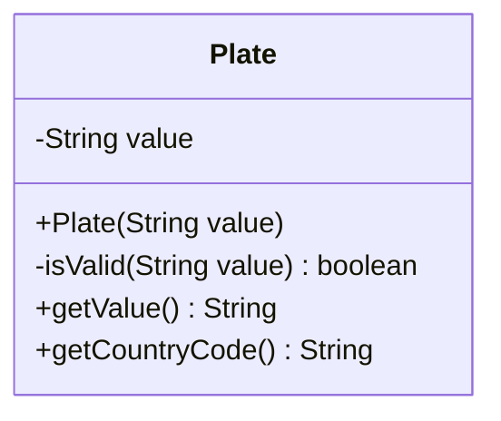

### Mutable Objects

#### Odometer
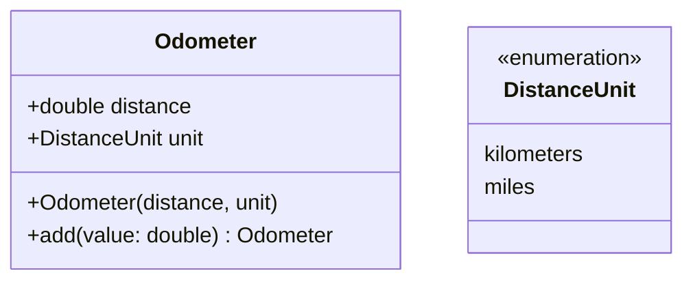

#### Tire Code
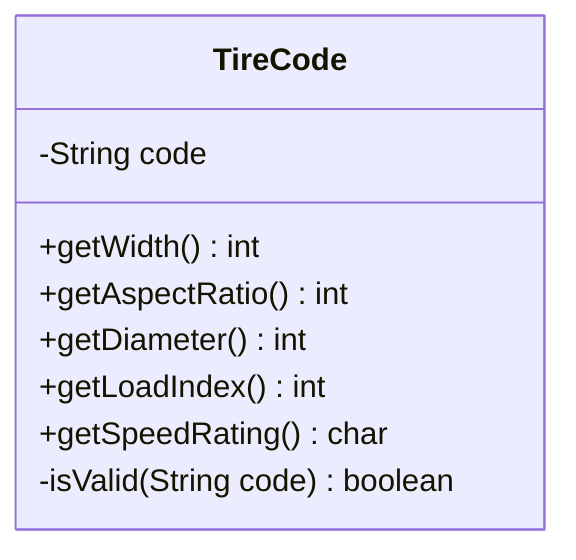

#### Paint Code
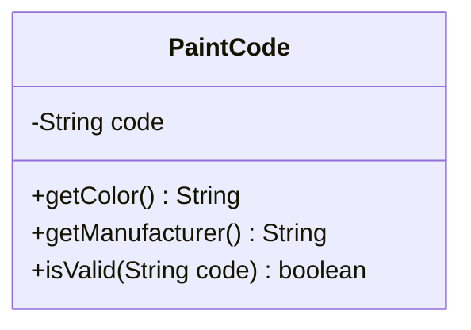
### Maintenance parts
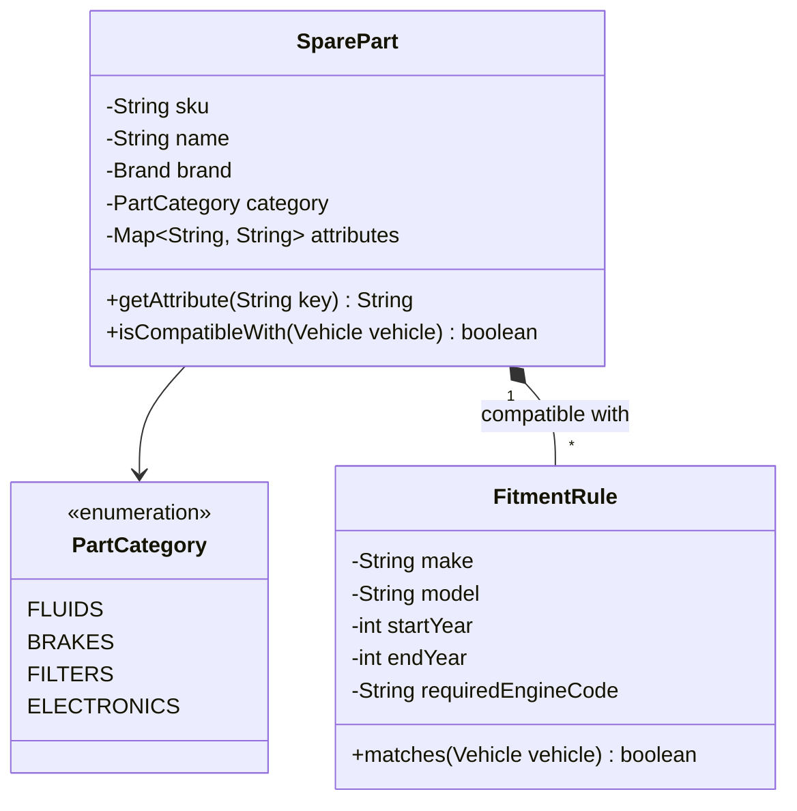
<details>
<summary>Examples</summary>
>Example 1: Engine Oil
>* SKU: "CAS-5W30-5L"
>* Name: "Castrol Edge 5W-30"
>* Category: FLUIDS
>* Attributes Map: * "Viscosity" -> "5W-30"
>* "Volume" -> "5L"
>* "Composition" -> "Synthetic"

>Example 2: Battery
>* SKU: "BOSCH-S4-005"
>* Name: "Bosch S4 Car Battery"
>* Category: ELECTRONICS
>* Attributes Map: * "Voltage" -> "12V"
>* "Capacity" -> "60Ah"
>* "CCA" -> "540A"
</details>

Here is the rest of the documentation to complete your App Architecture. I've added the missing **Core Entities (Aggregates)**, **Transactional Logs**, **Shared Value Objects**, and **Error Handling** based on your master diagram.

---

### Core Entities (Aggregates)

#### Vehicle

The root aggregate of the domain. It acts as the central hub tying the immutable identities (VIN, Plate) with the mutable state (Odometer) and logs.

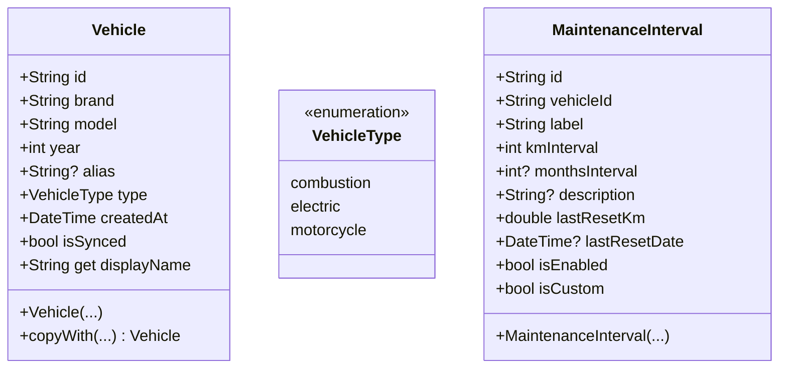

### Transactional Logs

These entities represent events that happen to a vehicle over time. They are strictly bound to a specific `Vehicle` via the `vehicleId`.

#### Fuel Log

Records a refueling event to track expenses and calculate fuel consumption (e.g., L/100km or MPG).

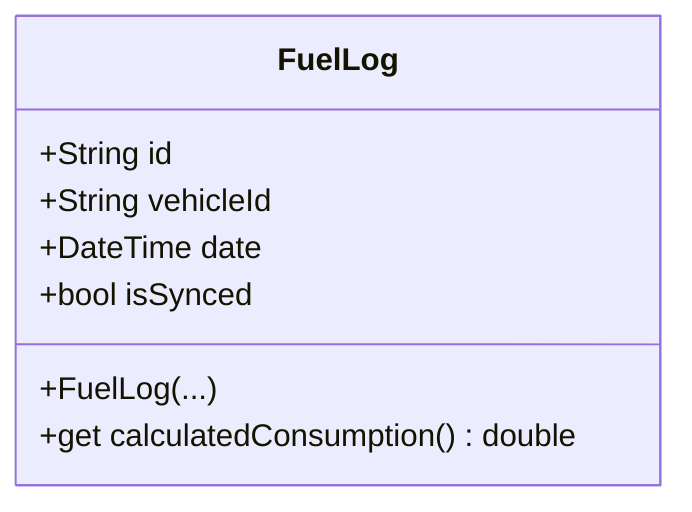

#### Maintenance Log

Records services or repairs performed on the vehicle.

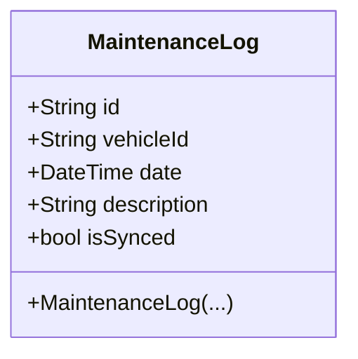

### Shared Value Objects

Generic, immutable value objects used across different entities to enforce formatting and prevent primitive obsession (e.g., passing a negative amount or mixing up liters and gallons).

#### Money & Volume

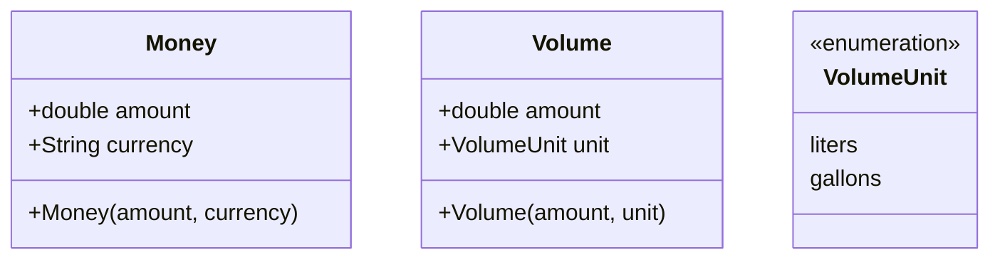

### Exceptions & Error Handling

Centralized domain errors ensure that business rules are strictly validated before any object is created or saved to the database.

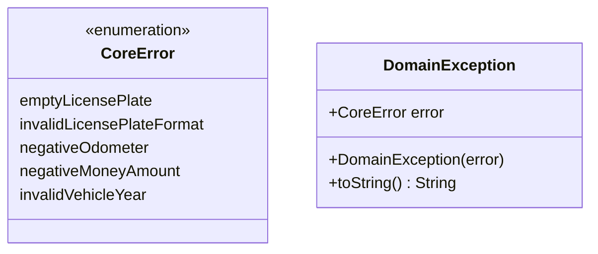