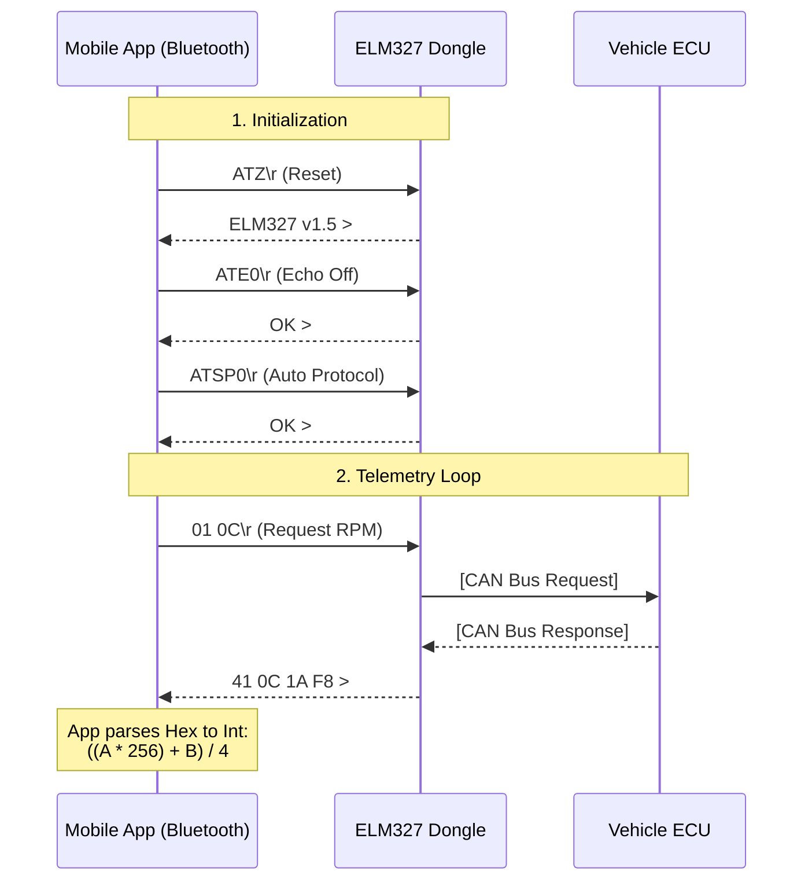
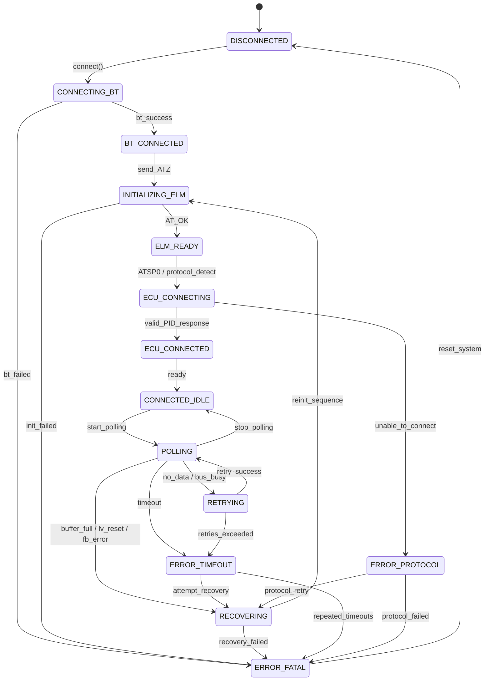

# OBD-II Communication Module (ELM327)
:::caution [DOCUMENTATION IN DEVELOPMENT]
**Warning:** This documentation module is currently in the process of creation and technical review. Some flowcharts or PID formulas may be subject to change until the final stable version.
:::

This module handles the real-time telemetry extraction from the vehicle's ECU via a Bluetooth ELM327-compatible dongle.
https://es.wikipedia.org/wiki/OBD-II_PID
## Architecture & Data Flow

> This is a example of requesting the Engine RPM (PID `0C`) and parsing the response. The app must implement a loop to continuously poll desired PIDs while the connection is active.

## State Machine (Connection Lifecycle)

1. **`DISCONNECTED`**: No Bluetooth socket active. No communication with the dongle.

2. **`CONNECTING_BT`**: Establishing SPP/BLE connection with the dongle’s MAC address.

3. **`BT_CONNECTED`**: Bluetooth link established successfully, but no communication with the ELM327 firmware yet.

4. **`INITIALIZING_ELM`**: Sending base `AT` commands (`ATZ`, `ATE0`, `ATL0`, `ATS0`, `ATH0`, `ATSPx`) to configure the ELM327.

5. **`ELM_READY`**: The ELM327 responded correctly with `OK` and prompt `>`. Firmware is responsive and ready.

6. **`ECU_CONNECTING`**: Attempting to establish communication with the vehicle ECU (protocol detection or bus initialization in progress, may show `SEARCHING...`).

7. **`ECU_CONNECTED`**: Successful ECU communication confirmed (e.g., valid response to `0100` or other test PID).

8. **`CONNECTED_IDLE`**: Fully connected and ready. Waiting for PID requests or queue processing.

9. **`POLLING`**: Actively sending PID requests in a loop and parsing responses.

10. **`RETRYING`**: Temporary communication issue detected (`NO DATA`, `BUS BUSY`, `STOPPED`). The system is retrying the last command with a retry counter.

11. **`RECOVERING`**: Medium-level fault detected (`BUFFER FULL`, `LV RESET`, `FB ERROR`). Performing partial reset, buffer flush, or reinitialization sequence.

12. **`ERROR_TIMEOUT`**: The ECU or dongle stopped responding within the configured timeout window.

13. **`ERROR_PROTOCOL`**: Protocol-level failure (`UNABLE TO CONNECT`, `BUS INIT...ERROR`, repeated `CAN ERROR`). ECU communication could not be established.

14. **`ERROR_FATAL`**: Critical failure state (Bluetooth disconnect, repeated initialization failure, unrecoverable firmware error). Requires full restart of the connection lifecycle.

## Standard PIDs Reference & Formulas

When reading Mode 01 (Live Data), the response will contain data bytes referenced as `A`, `B`, `C`, `D` depending on the payload length.
View more PIDs here: [Wikipedia](https://es.wikipedia.org/wiki/OBD-II_PID)

| PID (Hex) | Description | Expected Bytes | Formula to Decimal | Unit |
| --- | --- | --- | --- | --- |
| `01 04` | Engine Load | 1 (`A`) | `A / 2.55` | % |
| `01 05` | Coolant Temp | 1 (`A`) | `A - 40` | °C |
| `01 0C` | Engine RPM | 2 (`A`, `B`) | `((A * 256) + B) / 4` | RPM |
| `01 0D` | Vehicle Speed | 1 (`A`) | `A` | km/h |
| `01 10` | MAF Air Flow Rate | 2 (`A`, `B`) | `((A * 256) + B) / 100` | g/s |
| `01 2F` | Fuel Tank Level | 1 (`A`) | `A / 2.55` | % |

> **Warning:** Not all vehicles support all PIDs. The app must first query `01 00` to get a bit-encoded map of supported PIDs for the specific car.

## Error Handling

* **`SEARCHING...`**: The ELM327 is attempting to automatically detect the vehicle’s communication protocol. The application must wait for completion before sending new commands.

* **`NO DATA`**: No response was received from the ECU. The requested PID may not be supported, the engine may be off, or the ECU did not reply within the timeout period.

* **`CAN ERROR`**: A physical or low-level communication error occurred on the CAN bus. This may indicate wiring issues, electrical noise, or a faulty dongle.

* **`BUS ERROR`**: General bus communication failure. Often caused by protocol mismatch or electrical problems.

* **`BUS INIT...ERROR`**: The ELM327 failed while initializing communication with the vehicle’s protocol.

* **`BUS BUSY`**: The communication bus is currently busy or saturated. The application should retry after a short delay.

* **`DATA ERROR`**: Corrupted or malformed data was detected in the received frame.

* **`BUFFER FULL`**: The ELM327's internal buffer is full, likely due to too many queued commands without reading responses. The app should pause sending new commands until the buffer is cleared.

* **`ACT ALERT`**: Activity alert from the ELM327 indicating unusual or problematic bus communication activity.

* **`LV RESET`**: The ELM327 has reset due to low supply voltage. The app should reinitialize the adapter and verify vehicle battery stability.

* **`STOPPED`**: The current operation was interrupted, typically because a new command was issued before the previous one completed or due to a manual interrupt.

* **`UNABLE TO CONNECT`**: The ELM327 failed to establish communication with any ECU in the vehicle.

* **`FB ERROR`**: Firmware-level internal error reported by the ELM327. Common in clone adapters.

* **`?`**: The ELM327 received an unrecognized or improperly formatted command.

